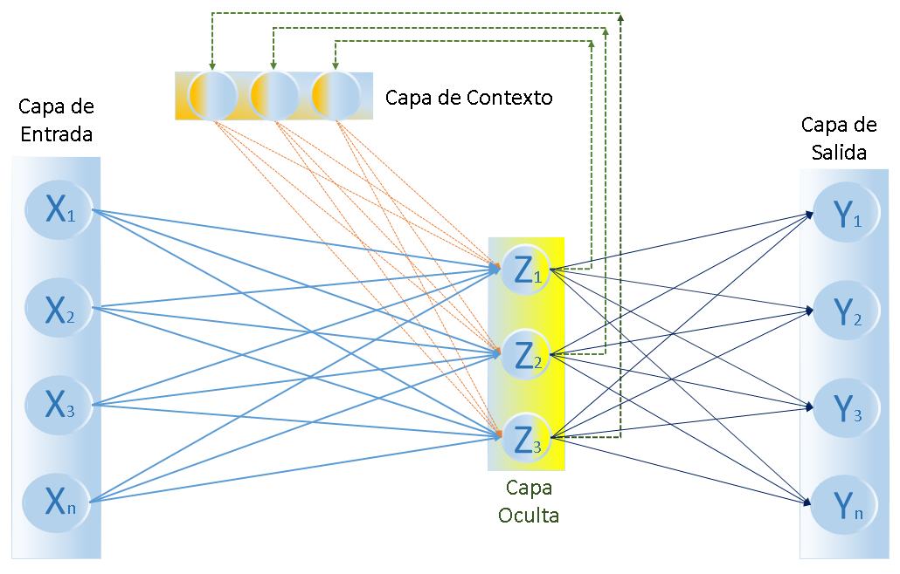
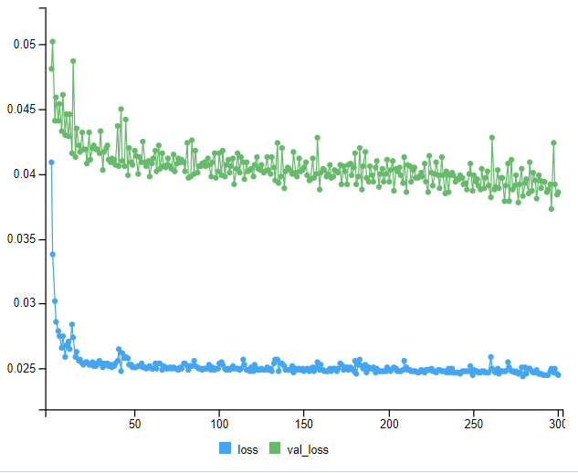

# Redes neuronales ELMAN y Jordan

En este capítulo se van a aplicar los modelos de redes neuronales ELMAN y Jordan comparando sus resultados contra los modelos anteriores para buscar cual es más adecuado para predecir las ventas.

Se inicia la preparación de los datos completando los días faltantes en la base de datos. Estos valores faltantes pueden ser días que no hubo venta o que no se subieron al repositorio, como no se tiene claro se van a agregar y se van a imputar sus valores usando interpolación lineal. Esto se hace porque estas redes neuronales son modelos recurrentes y dependen de una secuencia temporal continua para capturar dependencias temporales.

```{r dias_F, echo=FALSE}
# Cargar las librerías necesarias
library(prophet)
library(dplyr)
library(zoo)  # Para interpolación

# Crear un data.frame con todas las fechas
all_dates_df <- data.frame(ds = seq(as.Date("2024-03-01"), as.Date("2025-03-23"), by = "day"))

# Unir con ventas_diarias para rellenar días faltantes
ventas_diarias_complete <- all_dates_df %>%
  left_join(ventas_diarias, by = c("ds" = "fecha"))

# Generar dia_semana y mes para todas las fechas
ventas_diarias_complete <- ventas_diarias_complete %>%
  mutate(
    dia_semana = weekdays(ds, abbreviate = FALSE),
    dia_semana = factor(dia_semana, 
                        levels = c("Monday", "Tuesday", "Wednesday", "Thursday", "Friday", "Saturday", "Sunday"),
                        labels = c("Mon", "Tue", "Wed", "Thu", "Fri", "Sat", "Sun")),
    mes = months(ds, abbreviate = FALSE),
    mes = factor(mes, 
                 levels = c("January", "February", "March", "April", "May", "June", 
                            "July", "August", "September", "October", "November", "December"),
                 labels = c("Jan", "Feb", "Mar", "Apr", "May", "Jun", 
                            "Jul", "Aug", "Sep", "Oct", "Nov", "Dec"))
  )

# Renombrar la columna valor_total a y
ventas_diarias_complete <- ventas_diarias_complete %>%
  rename(y = valor_total)

# Imputar los NA con interpolación lineal
ventas_diarias_complete$y <- na.approx(ventas_diarias_complete$y, na.rm = FALSE)

# Dividir en entrenamiento y prueba
train_df <- ventas_diarias_complete[ventas_diarias_complete$ds <= as.Date("2025-03-16"), ]
test_df <- ventas_diarias_complete[ventas_diarias_complete$ds >= as.Date("2025-03-17") & 
                                   ventas_diarias_complete$ds <= as.Date("2025-03-23"), ]
```

Como las ventas presentan un comportamiento cíclico semanal se van a crear variables desfasadas con un valor de 7 para tener en cuenta esta cantidad de días en el modelo. Después se separan los conjuntos de entrenamiento y prueba y se normalizan debido a que las redes neuronales son sensibles a las escalas de los valores.

```{r prep_neuro, echo=FALSE}
# Crear una serie temporal con los datos
data <- c(train_df$y, test_df$y)
dates <- c(train_df$ds, test_df$ds)

# Crear lagged variables (ventana de 7 días)
lag_window <- 7
lagged_data <- embed(data, lag_window + 1)


# Dividir en entradas (X) y salidas (Y)
X <- lagged_data[, 1:lag_window]
Y <- lagged_data[, lag_window + 1]

# Calcular el número de filas disponibles
n_total_lagged <- nrow(X)
n_train_lagged <- floor(n_total_lagged * (nrow(train_df) / (nrow(train_df) + nrow(test_df))))
n_test_lagged <- n_total_lagged - n_train_lagged

# Dividir en entrenamiento y prueba
X_train <- X[1:n_train_lagged, ]
Y_train <- Y[1:n_train_lagged]
X_test <- X[(n_train_lagged + 1):n_total_lagged, ]
Y_test <- Y[(n_train_lagged + 1):n_total_lagged]

# Normalizar los datos
normalizeData <- function(x) { (x - min(x)) / (max(x) - min(x)) }
X_train_norm <- apply(X_train, 2, normalizeData)
Y_train_norm <- normalizeData(Y_train)
X_test_norm <- apply(X_test, 2, normalizeData)
Y_test_norm <- normalizeData(Y_test)

```

## ELMAN

Estructura: Es una red recurrente con una capa de entrada, una capa oculta, una capa de salida y una capa de contexto. La capa de contexto almacena las activaciones de las unidades ocultas del paso anterior y las retroalimenta como entrada adicional en el paso siguiente.

```{r ELMAN-imagen, echo=FALSE, fig.cap="Estrutura red ELMAN", out.width="80%"}

```

El modelo se entrenó con los siguientes parámetros usando la librería keras:

units = 10 
Este parámetro indica el número de neuronas de las capas ocultas y de contexto. Esta librería gestiona ambas capas automáticamente.

epochs = 250 
Este parámetro indica la cantidad de veces que el modelo repasa el conjunto de entrenamiento. Cada vez que esto ocurre se calculan nuevos gradientes para ajustar los pesos de la red neuronal para reducir la perdida.

batch_size = 2 
Indica el número de muestras procesadas antes de actualizar los pesos en cada iteración.

validation_split = 0.2: Con este parámetro se reserva el 20% de los datos de entrenamiento para validar el modelo durante el entrenamiento para evitar el sobreajuste.

```{r ELMAN, echo=FALSE}

library(keras)

# Modelo ELMAN simple con keras
model <- keras_model_sequential() %>%
  layer_simple_rnn(units = 10, input_shape = c(7, 1), return_sequences = FALSE) %>%
  layer_dense(units = 1)

model %>% compile(
  optimizer = "adam",
  loss = "mse"
)

# Reshape datos para keras (agregar dimensión de tiempo)
X_train_keras <- array_reshape(X_train_norm, dim = c(nrow(X_train_norm), 7, 1))
X_test_keras <- array_reshape(X_test_norm, dim = c(nrow(X_test_norm), 7, 1))
Y_train_keras <- array_reshape(Y_train_norm, dim = c(length(Y_train_norm), 1))

# Entrenar el modelo
model %>% fit(
  X_train_keras, Y_train_keras,
  epochs = 250,
  batch_size = 2,
  validation_split = 0.2
)


```

Después de entrenar la red neuronal estos fueron los resultados.

```{r ELMAN_R, echo=FALSE}
# Predicciones
predictions_keras_norm <- model %>% predict(X_test_keras)
predictions_keras <- predictions_keras_norm * (max(data) - min(data)) + min(data)

# Desnormalizar las predicciones
max_value <- max(data)
min_value <- min(data)
predictions_elman <- predictions_keras_norm * (max_value - min_value) + min_value

# Desnormalizar los valores reales de prueba (Y_test)
actual_values_elman <- Y_test_norm * (max_value - min_value) + min_value

# Calcular RMSE y MAE
rmse_keras <- rmse(actual_values_elman, predictions_elman)
mae_keras <- mae(actual_values_elman, predictions_elman)

# Mostrar resultados
cat("RMSE Keras ELMAN:", rmse_keras, "\n")
cat("MAE Keras ELMAN:", mae_keras, "\n")

# Graficar ELMAN (asumiendo que actual_values_elman y predictions_elman tienen 7 valores)
plot(dates[(n_train_lagged + 1):(n_train_lagged + 7)], actual_values_elman, type = "b", col = "green",
     main = "Predicciones ELMAN vs Valores Reales", xlab = "Fecha", ylab = "Ventas",
     ylim = range(c(actual_values_elman, predictions_elman), na.rm = TRUE))
lines(dates[(n_train_lagged + 1):(n_train_lagged + 7)], predictions_elman, type = "b", col = "purple")
legend("topright", legend = c("Reales", "Predicciones"), col = c("green", "purple"), lty = 1)
```
En la grafica de real vs predicciones se ve que el modelo se mantiene en el promedio de las ventas reales, con esto se puede concluir que el modelo no es capaz de predecir los comportamientos atipicos de ventas, esto es un resultado parecido al modelo prophet.

```{r ELMAN-train, echo=FALSE, fig.cap="Estrutura red ELMAN", out.width="80%"}
knitr::include_graphics("images/Elman_train.png")
```

Esta gráfica representa la evolución de la función de pérdida a lo largo de las 200 épocas del modelo. El eje x muestra el número de épocas y el eje y muestra el valor de la pérdida.

Loss (Línea azul) representa el valor de la función de pérdida (mse) el conjunto de entrenamiento después de cada época. Mide cuán lejos están las predicciones del modelo de los valores reales en los datos con los que se entrena.

Val_loss (Línea verde) representa la misma funcion de perdida de loss pero contra el conjunto de validación.
Esta linea indica si el modelo está aprendiendo patrones útiles o sobreajustando. Si val_loss aumenta mientras loss disminuye, es una señal de sobreajuste.

Ambas líneas disminuyen la perdida rápidamente antes de las 50 epocas y luego se estabilizan. Esto indica que el modelo encuentra una configuración de pesos que minimiza la pérdida. Esto indica que el modelo generaliza bien, ya que la funcion de pérdida en validación no diverge significativamente del valor en entrenamiento.

Después de 100 épocas ambas líneas se mantienen relativamente estables con una tendencia muy poco significativa hacia abajo, con algunas fluctuaciones.Esto implica que entrenar más allá de 200 épocas probablemente no mejorará mucho el rendimiento, ya que el modelo ha alcanzado un punto de mínima pérdida.

## Jordan

Estructura: Es similar a la ELMAN, pero la capa de contexto almacena las salidas del paso anterior y(t-1) en lugar de las activaciones ocultas como retroalimentación junto a las entradas actuales x(t) para generar las activaciones ocultas h(t) y dar el pronostico del valor actual y(t).

```{r Jordan-imagen, echo=FALSE, fig.cap="Estrutura red ELMAN", out.width="80%"}
knitr::include_graphics("images/Jordan.jpg")
```

El modelo se entrenó nuevamente usando la librería keras con los siguientes parámetros:

units = 30.

epochs = 300.

batch_size = 40.

validation_split = 0.2.

```{r Jordan_prep, echo=FALSE}
# Preparar datos con la salida previa como entrada
# Crear un vector de salidas previas desplazadas
Y_prev_train <- c(NA, Y_train_norm[-length(Y_train_norm)])  # NA para el primer valor, luego Y(t-1)
Y_prev_test <- c(NA, Y_test_norm[-length(Y_test_norm)])

# Eliminar la primera fila donde Y_prev es NA
X_train_with_prev <- cbind(X_train_norm[-1, ], Y_prev_train[-1])
X_test_with_prev <- cbind(X_test_norm[-1, ], Y_prev_test[-1])
Y_train_with_prev <- Y_train_norm[-1]
Y_test_with_prev <- Y_test_norm[-1]

# Ajustar dimensiones para Keras
X_train_keras <- array_reshape(X_train_with_prev, dim = c(nrow(X_train_with_prev), 8, 1))  # 7 lagged + 1 previo
X_test_keras <- array_reshape(X_test_with_prev, dim = c(nrow(X_test_with_prev), 8, 1))
Y_train_keras <- array_reshape(Y_train_with_prev, dim = c(length(Y_train_with_prev), 1))


```

```{r Jordan, echo=FALSE}

# Crear el modelo Jordan
model <- keras_model_sequential() %>%
  layer_simple_rnn(units = 30, input_shape = c(8, 1), return_sequences = FALSE) %>%
  layer_dense(units = 1)

# Compilar el modelo
model %>% compile(
  optimizer = "adam",
  loss = "mse"
)

# Entrenar el modelo
history <- model %>% fit(
  X_train_keras, Y_train_keras,
  epochs = 300,
  batch_size = 50,
  validation_split = 0.2,
  verbose = 1
)

# Predicciones
predictions_keras_norm <- model %>% predict(X_test_keras)


```


Después de entrenar la red neuronal estos fueron los resultados.


```{r Jordan_res, echo=FALSE}
# Desnormalizar
max_value <- max(data, na.rm = TRUE)
min_value <- min(data, na.rm = TRUE)
range_value <- max_value - min_value
predictions_keras <- predictions_keras_norm * range_value + min_value
actual_values <- Y_test_with_prev * range_value + min_value  # Ajustado por la eliminación de la primera fila

# Calcular RMSE y MAE
rmse_keras <- rmse(actual_values, predictions_keras)
mae_keras <- mae(actual_values, predictions_keras)

# Mostrar resultados
cat("RMSE Keras Jordan:", rmse_keras, "\n")
cat("MAE Keras Jordan:", mae_keras, "\n")

# Graficar
plot_dates <- dates[(n_train_lagged + 1):(n_train_lagged + 6)]  # 6 fechas (del 18 al 23 de marzo)
plot(plot_dates, actual_values, type = "b", col = "red",
     main = "Predicciones Jordan vs Valores Reales", xlab = "Fecha", ylab = "Ventas",
     ylim = range(c(actual_values, predictions_keras), na.rm = TRUE))
lines(plot_dates, predictions_keras, type = "b", col = "blue")
legend("topright", legend = c("Reales", "Predicciones"), col = c("red", "blue"), lty = 1)

```

Igual que en la grafica de ELMAN el modelo se mantiene en el promedio de las ventas reales y tiene el mismo problema para predecir los comportamientos atipicos de ventas.

```{r jordan-train, echo=FALSE, fig.cap="Estrutura red ELMAN", out.width="80%"}

```

Esta gráfica representa la evolución de la función de pérdida del modelo Jordan, su comportamiento es muy similar al caso de ELMAN con la diferencia que los valores iniciales de perdida fueron más bajos (0.05) que los de ELMAN (0.08). Se aumentó la cantidad de epocas (300) buscando una mejor función de perdida, aunque el resutlado de este modelo es mejor al de ELMAN el resultado sigue siendo menos favorable que usar SARIMA.

Igual que en ELMAN ambas líneas disminuyen la perdida rápidamente antes de las 50 epocas y luego se estabilizan.

Después de 100 épocas ambas líneas se mantienen relativamente estables con una tendencia muy poco significativa hacia abajo, con algunas fluctuaciones.

## Resultados

En esta tabla se comparan los resultados de los modelos de las redes ELMAN y Jordan contra los demás modelos usado en el curso.
```{r esultados, echo=FALSE}
# Crear la tabla de métricas
metrics_table <- rbind(
  `Holt-Winters Aditivo` = c(RMSE = 140.4213, MAE = 111.8802),
  `Holt-Winters Multiplicativo` = c(RMSE = 143.8373, MAE = 115.8820),
  `SARIMA` = c(RMSE = 137.7336, MAE = 109.1637),
  `Prophet sin regresores` = c(RMSE = 196.8354, MAE = 146.5227),
  `Prophet con regresores` = c(RMSE = 176.8185, MAE = 134.5342),
  `Red ELMAN` = c(RMSE = 335.8276, MAE = 276.9099),
  `Red Jordan` = c(RMSE = 301.6187, MAE = 246.2491)
)

# Mostrar la tabla
print(metrics_table)
```
Como se ve, ambos modelos de las redes neuronales fueron las menos efectivas en su pronostico. Entra las posibles causas están el tamaño limitado del conjunto de datos, el conjunto solo contró con 381 días para entrenar la red cuando normalmente se usan grandes cantidades de datos para aprender patrones complejos y evitar sobreajuste. Esta poca cantidad pudo crear un sobreajuste en el modelo que se nota al ver que val_loss no disminuye en ninguno de los modelos
Ademas, para poder hacer el entrenamiento fue necesario agregar los días faltantes e imputar los valores, aunque fueron pocos valores estos pudo volverse ruido.

